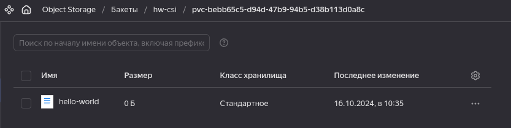

В YC создаем бакет и сервис аккаунт для доступа к бакету 

- создаем секрет
kubectl create -f secret.yaml

- деплоим драйвер
    - kubectl create -f provisioner.yaml
    - kubectl create -f driver.yaml
    - kubectl create -f csi-s3.yaml

- Создаем новый класс, pvc и pod
  - kubectl create -f sc.yaml
  - kubectl create -f pvc.yaml
  - kubectl create -f pod.yaml

В результате в бакете получем созданный файл hello-world

